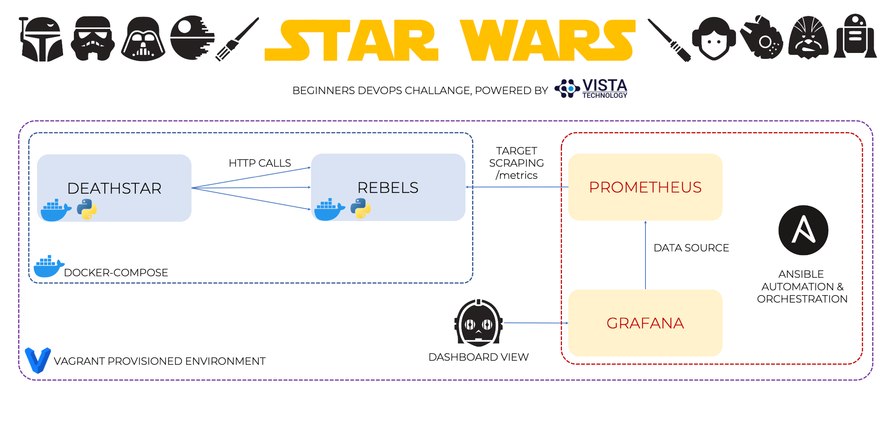
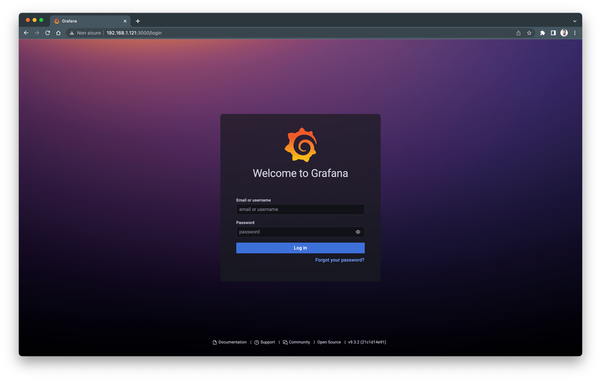

# Job Challenge DevOps: livello Beginners



## Scopo

Lo scopo di questa challenge è quella di testare le capacità del candidato su alcuni temi base, quali ad esempio:

- containerizzazione
  - utilizzo di Docker e Docker-compose
- automazione
  - sviluppo e utilizzo di semplici playbook Ansible per la creazione di task
- monitoraggio
  - allestimento di uno stack Prometheus + Grafana per raccolta metriche e consultazione

All'interno di questo repository ci sono 2 semplici applicativi python che fungeranno da sorgente di monitoraggio e alcuni file necessari per l'automazione e il deploy dello stack di monitoraggio, nonché una dashboard già preconfezionata pronta per essere importata in Grafana e mostrare le metriche raccolte.

Alcuni file all'interno del repository non sono completi. Sarà cura del candidato andare a completare correttamente i file per ottenere il risultato desiderato.
Ogni volta che servirà inserire le informazioni mancanti, si troverà direttamente all'interno del file il commento __### ATTENZIONE ###__.

Tutto l'ambiente di laboratorio si svolgerà all'interno di una VM (una Ubuntu 22.04 64), il cui provisioning è gestito da Vagrant (VirtualBox come provider).

La VM creata richiederà 2,5GB di RAM e 2 vCPU.

_May the force be with you_

## Prerequisiti

Occorre avere installato sul proprio PC/Laptop i seguenti sw:

- Vagrant (versione 2.4.1) (<https://developer.hashicorp.com/vagrant/downloads>)
- VirtualBox (versione 7.0.22) (<https://www.virtualbox.org/wiki/Downloads>)

## Struttura del repository

All'interno del repository si trova il Vagrantfile che verrà utilizzato da vagrant per allestire la VM su cui esercitare il laboratorio.

All'interno della cartella _starwars_ sono presenti altre due folder denominate _deathstar_ e _rebels_, sono i due applicativi che devono essere mandati in esecuzione con docker-compose.

All'interno della cartella _monitoring_ sono presenti altre 2 folder denominate _prometheus_ e _grafana_.
All'interno di queste due sottocartelle troviamo tutti i file necessari per l'automazione Ansible utile ad installare sia Prometheus che Grafana.

## Allestimento laboratorio

Clonare il repository in locale e posizionarsi all'interno della cartella

```shell
❯ git clone https://github.com/Vista-Technology/job-challenge-beginners
❯ cd job-challenge-beginners
```

Installare un plugin aggiuntivo per Vagrant, relativamente a docker-compose

```shell
❯ vagrant plugin install vagrant-docker-compose
```

Creare a far partire la VM, che avrà già preinstallato docker, docker-compose e ansible

```shell
❯ vagrant up
```

| __ATTENZIONE__ durante l'avvio vi verrà chiesto di scegliere quale interfaccia network utilizzare. Selezionate l'interfaccia principale del vostro PC/Laptop in maniera tale che il network sia condiviso da host e guest VM. Ciò vi consentire di accedere, ad esempio, direttamente dal vostro browser a Prometheus e Grafana, semplicemente andando a indicare nell'URL l'indirizzo IP della VM che Vagrant creerà.

| __ATTENZIONE__ La procedura potrebbe richiedere fino a 30 minuti per il corretto completamento. Non considerate i log di output durante l'installazione finale di minikube, sono molto verbosi e fuorvianti (il rosso non è indicativo di un reale errore).

```shell
❯ vagrant up
Bringing machine 'default' up with 'virtualbox' provider...
==> default: Checking if box 'ubuntu/jammy64' version '20221229.0.0' is up to date...
==> default: Clearing any previously set forwarded ports...
==> default: Clearing any previously set network interfaces...
==> default: Available bridged network interfaces:
1) en0: Wi-Fi
2) en3: USB Ethernet(?)
3) awdl0
4) bridge0
5) llw0
6) en1: Thunderbolt 1
7) en2: Thunderbolt 2
==> default: When choosing an interface, it is usually the one that is
==> default: being used to connect to the internet.
==> default: 
    default: Which interface should the network bridge to? 1
```

Nell'esempio è stata selezionata l'interfaccia indicata con il numero 1 dalla lista.

Constatate di riuscire ad accedere alla VM appena creata in SSH

```shell
❯ vagrant ssh
Welcome to Ubuntu 22.04.1 LTS (GNU/Linux 5.15.0-56-generic x86_64)

 * Documentation:  https://help.ubuntu.com
 * Management:     https://landscape.canonical.com
 * Support:        https://ubuntu.com/advantage

  System information as of Wed Jan  4 15:01:23 UTC 2023

  System load:                      0.13916015625
  Usage of /:                       10.2% of 38.70GB
  Memory usage:                     47%
  Swap usage:                       0%
  Processes:                        115
  Users logged in:                  0
  IPv4 address for br-71b2af965783: 172.18.0.1
  IPv4 address for docker0:         172.17.0.1
  IPv4 address for enp0s3:          10.0.2.15
  IPv4 address for enp0s8:          192.168.1.121

 * Strictly confined Kubernetes makes edge and IoT secure. Learn how MicroK8s
   just raised the bar for easy, resilient and secure K8s cluster deployment.

   https://ubuntu.com/engage/secure-kubernetes-at-the-edge

0 updates can be applied immediately.


Last login: Wed Jan  4 11:51:31 2023 from 10.0.2.2
vagrant@ubuntu-jammy:~$
```

Memorizzate l'indirizzo IPv4 che vedete assegnato come ultimo, sarà quello che vi consentirà di accedere alla VM dal vostro host.
Nel caso ad esempio 192.168.1.121.

Troverete tutto il vostro ambiente di lavoro all'interno del path /vagrant, dentro la VM

```shell
vagrant@ubuntu-jammy:~$ ls -al /vagrant
total 16
drwxr-xr-x  1 vagrant vagrant  224 Jan  4 14:33 .
drwxr-xr-x 20 root    root    4096 Jan  4 11:32 ..
-rw-r--r--  1 vagrant vagrant 6148 Jan  4 14:34 README.md
drwxr-xr-x  1 vagrant vagrant  192 Jan  4 14:33 .vagrant
-rw-r--r--  1 vagrant vagrant  459 Jan  3 10:43 Vagrantfile
drwxr-xr-x  1 vagrant vagrant  224 Jan  4 14:33 docs
drwxr-xr-x  1 vagrant vagrant  160 Jan  4 14:33 monitoring
drwxr-xr-x  1 vagrant vagrant  224 Jan  4 14:33 starwars
```

Il laboratorio è quindi pronto per cominciare la challenge!

# ESERCIZIO 1: Completare l'applicativo `deathstar` ed eseguirlo

All'interno della cartella `starwars/deathstar` è presente una bozza di applicativo che va completato per il corretto funzionamento il cannone KyberCannon.

Per il suo completamento è necessario scrivere all'interno del file `ds1KyberCannon.py` nella funzione `def run()` il codice per fare fuoco verso la basi ribelli.

- Eseguire una chiamata http verso uno degli endpoint
- Rendere randomica la selezione dei target da chiamare (definiti nella variabile `endpoints`)

# ESERCIZIO 2: eseguire la build delle immagini degli applicativi python

All'interno delle cartelle `starwars/deathstar` e `starwars/rebels` sono presenti i file di requirement e il codice python che compongono le applicazioni e le loro dipendenze.
Esiste già anche il Dockerfile, in ognuna delle due cartelle, utile alla descrizione della build, tuttavia è pressoché vuoto e va completato.

l'esercizio consiste nel completare i due Dockerfile e lanciare le build per costruire le due immagini containerizzate.

Le immagini dovranno essere taggate rispettivamente come:

- deathstar:latest
- rebels:latest

### Link utili

- <https://docs.docker.com/engine/reference/commandline/build/>

# ESERCIZIO 3: deploy con docker-compose

All'interno della cartella `starwars` esiste il file di descrizione `docker-compose.yml`, tale file serve per avviare i container dei due applicativi buildati in precedenza.
Anche in questo caso il file non è completo.

Eseguire le istruzioni contenute in esso per inserire le informazioni mancanti e avviare tutto con il comando docker-compose.

Verificare poi che i 2 servizi siano correttamente up&running

### Link utili

- <https://docs.docker.com/compose/compose-file/>
- <https://docs.docker.com/engine/reference/commandline/compose_up/>
- <https://docs.docker.com/engine/reference/commandline/compose_ps/>
- <https://docs.docker.com/engine/reference/commandline/ps/>
- <https://docs.docker.com/engine/reference/commandline/compose_logs/>
- <https://docs.docker.com/compose/compose-file/>

# ESERCIZIO 4: installazione automatizzata di Prometheus e Grafana

Spostiamoci ora nella cartella `monitoring`.
Dentro le sottocartelle `prometheus` e `grafana` sono contenuti i file denominati `playbook.yaml`, sono i file che contengono i task Ansible utilizzati dall'installazione automatizzata sia di Prometheus che di Grafana.

I task descritti all'interno dei file non sono completi, vanno quindi inserite le informazioni mancanti seguendo le istruzioni.

Inoltre, per quanto riguarda Prometheus, anche il file di configurazione (config.yml) va completato inserendo le informazioni di scraping mancanti per l'applicativo "rebels".

Una volta completati i file si può eseguire la procedura di automazione, andando, per ognuna delle cartelle, ad eseguire il comando ansible-playbook relativamente al file playbook.yaml.

Lanciati i due playbook ansible, si vada a verificare che entrambi i servizi sono attivi, per esempio visitando le rispettive GUI:

- Prometheus: <http://IP-della-VM:9090>
- Grafana: <http://IP-della-VM:3000>




### Link utili

- <https://docs.ansible.com/ansible/latest/playbook_guide/playbooks_intro.html>
- <https://prometheus.io/docs/prometheus/latest/configuration/configuration>

# ESERCIZIO 5: configurazione Grafana

Utilizzando la GUI di Grafana si dovranno configurare:

- Un nuovo Data Source per Prometheus
  - nome del data source: "Prometheus"
  - URL: l'indirizzo IP della VM sulla porta 9090
- Import di una dashboard completa di grafici preconfigurati
  - importare il file JSON chiamato `starwars.json` che si trova all'interno della folder `monitoring/grafana/dashboards`
- impostare il Tema light come grafica di default

Per l'accesso alla GUI le credenziali iniziali (verrà poi chiesto di modificare la password al primo accesso) sono admin:admin

Verificare il corretto funzionamento della dashboard


| la dashboard dovrebbe apparire come quella in figura.

### Link utili

- <https://grafana.com/docs/grafana/latest/administration/data-source-management/>
- <https://grafana.com/docs/grafana/v9.0/dashboards/export-import/>
- <https://grafana.com/docs/grafana/v8.5/administration/preferences/change-grafana-theme/>

# ESERCIZI BONUS

Se ti sei annoiato e gli esercizi sono stati sin troppo semplici eccoti un sfida un pochino più interessante!

All'interno della VM troverai già installato un cluster Kubernetes con minikube (e il comando kubectl).
Prova a rifare l'esercizio 3 andando a mettere i deployment all'interno di un nuovo namespace, chiamato starwars, all'interno del cluster Kubernetes, invece di utilizzare il docker-compose.

Ricordati di inserire tutti i file manifest che utilizzerai. Mettili dentro una cartella chiamata _bonus_

# Risultato finale

Una volta terminati tutti gli esercizi in locale, spegnere l'ambiente di laboratorio con il comando

```shell
❯ vagrant halt
```

Inviare una copia del disco della macchina in modo da permettere la verifica del lavoro svolto.

Se si vuole ripulire tutto l'ambiente di laboratorio eseguire il comando

```shell
❯ vagrant destroy
```

### Link utili

- <https://grafana.com/docs/grafana/latest/dashboards/share-dashboards-panels/>
